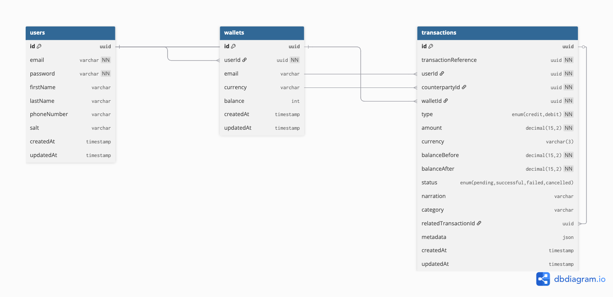

# Lendsqr Demo Credit – Design Documentation

---

## 1. Purpose
This repository contains a minimal yet production-ready credit-wallet API built for **Lendsqr** as a demo.  
It exposes REST endpoints that allow a client to:

* register / log-in users
* create and manage wallets
* fund wallets, transfer funds, withdraw funds
* view transactions with pagination & filtering

The service is written in **TypeScript** on **Fastify** and backed by **MySQL** via **Knex**.  
It is designed to be lightweight, modular, and easy to deploy.

---

## 2. High-Level Architecture
```
           ┌────────────┐            ┌──────────────┐
 Client ───▶│ Fastify App│──Plugins──▶│  Route Handlers│──▶ Services / Helpers ─▶ MySQL (Knex)
           └────────────┘            └──────────────┘
```
1. **Fastify App** (`src/index.ts`)
   * Boots the server, loads plugins, registers all routes, and starts listening.
2. **Plugins** (`src/plugins/*`)
   * Cross-cutting concerns (env config, logging, JWT auth, pagination, response formatter).
3. **Route Handlers** (`src/routes/**`)
   * Feature-scoped (auth, transaction, wallet, user).
4. **Services / Helpers / Lib**
   * `src/lib/**` → integrations (Axios wrapper, Knex instance, JWT helpers, pino logger, external Lendsqr client).
   * `src/helpers/**` → pure utility functions (ID generators, hashing helpers, etc.).
5. **Persistence**
   * MySQL schema managed by **Knex Migrations** (`/migrations`) and **Seeds** (`/seeds`).
6. **Background Jobs**
   * `src/cron-jobs` – scheduled tasks powered by **node-cron**.

---

## 3. Folder Structure
```
.
├── migrations/          # DB schema migrations
├── seeds/               # Sample/initial data loaders
├── src/
│   ├── config/          # Env schema & status codes constants
│   ├── cron-jobs/       # node-cron scheduled jobs
│   ├── helpers/         # Reusable helper utilities
│   ├── interfaces/      # Shared TypeScript interfaces & types
│   ├── lib/             # External-service adapters & singletons
│   ├── plugins/         # Fastify plugins (auth, pagination, logger …)
│   ├── routes/          # Route modules grouped by feature
│   │   ├── auth/
│   │   ├── transaction/
│   │   ├── user/
│   │   └── wallet/
│   ├── utils/           # Generic utilities (e.g., ApiResponse wrapper)
│   └── index.ts         # Application entry-point
├── knexfile.js          # Knex environment configuration
├── package.json         # npm scripts & dependencies
└── tsconfig.json        # TypeScript compiler options
```

---

## 4. Request Flow
1. **HTTP Request** reaches Fastify.
2. **Request-Logger Plugin** logs metadata.
3. **Authenticator Plugin** (optional) validates JWT & attaches `request.user`.
4. **Route Handler** executes business logic.
5. **Knex Layer** performs DB queries inside a transaction where appropriate.
6. **Response-Handler Plugin** standardises success/error payloads.

All errors propagate through Fastify’s error handler and are wrapped by `ApiResponse.error()` with an appropriate status code from `src/config/status-codes.constants.ts`.

---

## 5. Database Design (ERD)



---

## 6. Environment Variables (`.env`)
The schema is enforced via `@fastify/env` in `src/config/index.ts`. Core vars:

* `PORT` – Port to listen on (default 3000)
* `DATABASE_URL` – MySQL connection string
* `JWT_SECRET` – Secret for signing auth tokens
* `LENDSQR_API_KEY` – Credentials for Lendsqr external service

Ensure these are provided before running the server.

---

## 7. Running Locally
```bash
# Install deps
npm install

# Run database migrations & seeds
npm run migration:run && npm run seeds:run

# Start dev server (hot-reload)
npm run start:dev
```
Server logs will state `Ready! <PORT>` when boot-strapped.

### Tests
```bash
# All tests
npm test

# Watch mode
npm run test:watch

# Interactive coverage UI
npm run test:ui
```
Tests are written with **Vitest** and cover route handlers & helpers.

---

## 8. Key Dependencies
Dependency | Role
-----------|------
`fastify` | Core HTTP framework
`@fastify/*` | Official Fastify plugins (JWT, CORS, env, multipart, cookie…)
`knex`, `mysql2` | SQL query builder & driver
`argon2` | Password hashing
`node-cron` | Scheduling background tasks
`zod` | Runtime schema validation
`vitest` | Unit/integration testing
`pino` & `pino-pretty` | Structured logging

---

## 9. Security Considerations
* Passwords hashed with **argon2id**.
* JWT tokens signed with `HS256` using `JWT_SECRET`.
* CORS controlled via `@fastify/cors` (update origins in prod).

---

